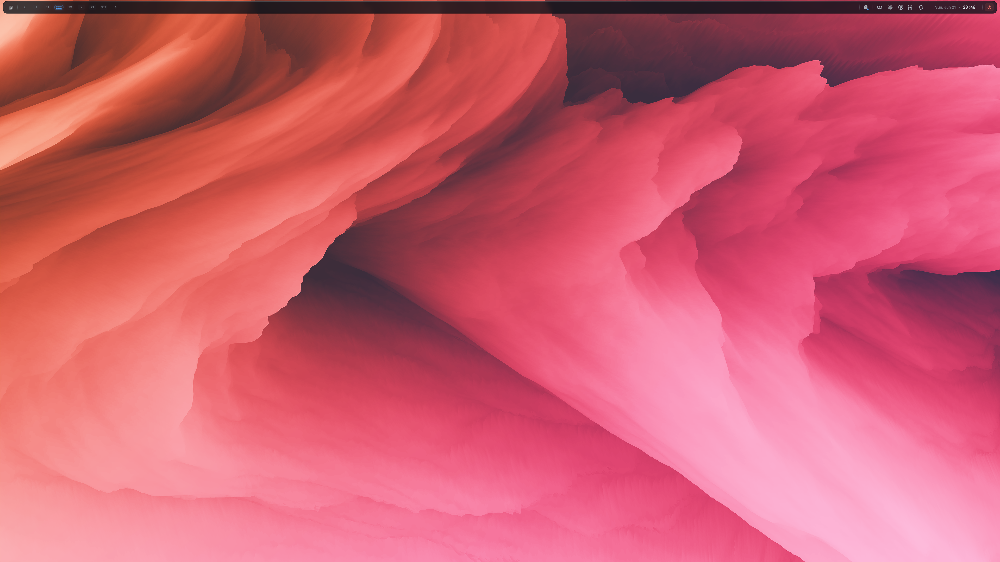

<p align="center">
  
</p>

<h1 align="center">hyprbaric</h1>

<p align="center">A status bar for hyprland built on Flutter and Rust.</p>

<p align="center">
  
</p>

> [!NOTE]
> hyprbaric is pre-1.0 software. Interfaces and configuration may still change.

## Documentation

Explore the [hyprbaric documentation site](https://asaphaaning.github.io/hyprbaric/) for installation, configuration, shortcuts, and a closer look at the bar in action.

## Scope and requirements

hyprbaric is Linux-only and targets hyprland, with a Flutter UI, Rust backend, and a small native layer-shell shim.

Core runtime requirements are hyprland, GTK 3, GTK layer shell, Wayland, and `xdg-desktop-portal-hyprland`. Individual features can additionally use WirePlumber, NetworkManager, `grim`, `slurp`, `wf-recorder`, `hyprpicker`, `hyprsunset`, `ddcutil`, UPower, and power-profiles-daemon. See [runtime dependencies](docs/runtime-dependencies.md) for the distro package matrix and the distinction between core and optional integrations.

## Install the latest release

When a packaged GitHub release is available, the installer chooses its matching DEB, RPM, or Pacman package and falls back to the AppImage elsewhere:

```sh
curl --proto '=https' --tlsv1.2 -sSf https://raw.githubusercontent.com/asaphaaning/hyprbaric/master/install.sh | sh
```

To inspect the script or pin a release, download it first and run `sh install.sh --version vX.Y.Z`. The full [installation guide](https://asaphaaning.github.io/hyprbaric/docs/installation) covers the distro-package and source-build alternatives.

## Build and run from source

Install Flutter and Rust, then run the development build:

```sh
git clone https://github.com/asaphaaning/hyprbaric.git
cd hyprbaric
flutter pub get
flutter run -d linux
```

For a release bundle, use `flutter build linux --release`. The Linux build output is relocatable; consult the [installation guide](https://asaphaaning.github.io/hyprbaric/docs/installation) for package-build and hyprland autostart guidance.

## Architecture

- Flutter owns rendering, interaction, and shared UI state.
- Rust owns domain state, compositor and portal integration, commands, and events.
- The native Linux host owns GTK, layer-shell setup, transparency, and native hit regions.

Keep raw platform data at those boundaries; internal features communicate through typed Rust and Flutter models. See [AGENTS.md](AGENTS.md) for the project conventions.

## Verify changes

```sh
cargo test --workspace
flutter analyze lib test
flutter test
```

## Packaging

`packaging/` contains Fastforge metadata for AppImage, DEB, RPM, and Pacman artifacts, plus an AUR-oriented `PKGBUILD` template. Run `./packaging/build-linux-packages` to build the Linux package artifacts in a prepared release environment.

## License

hyprbaric is released under the AGPL-3.0. See [LICENSE](LICENSE).
